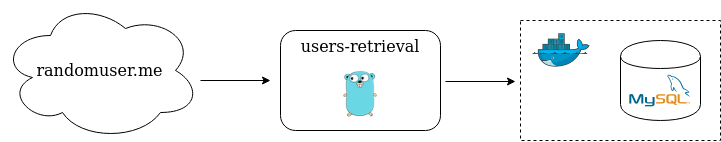

# Go-mysql-rest

This project is an example of REST API consumption and MySQL persistence and retrieval using Go.

## Project Contents
1. A [docker-composer yaml file](docker/docker-compose.yml)
2. A [user-retrieval](users-retrieval/usersretrieval.go) Go program

## Structure and flow

When "user-retrieval" program is executed, it consumes the [randomuser.me](http://randomuser.me) REST API to retrieve random user information and persists it on a MySQL database. Then it retrieves these new users from database and prints its information, the total users persisted and the total amount of users on database.

# Requirements
The following versions were the ones used to create it on my environment. Higher versions might work as well, but who knows? :)
- Docker 19.03.2
- Docker compose 1.21.0
- Java 1.8
- Maven 3.6.2
- Go 1.13.4

## Execution

1. On [docker](docker/) directory, start MySQL container using `docker-compose up` command. It will also use the scripts stored in [docker-entrypoint-init-db.d](docker/mysql/docker-entrypoint-init-db.d) directory to create the required database, user and table for program execution.
2. On [user-retrieval](user-retrieval/) directory, execute `go build` to generate the program executable.
3. Execute `./user-retrieval` to start the program. The program also accepts a `users` parameter to change the amount of users retrieved from randomuser.me API, e. g. `./user-retrieval -users=100`

## (no-so) FAQs

**Q:** _How can I check if the users are REALLY being stored on database._

**A:** The MySQL Docker container created will also map its 3306 port with the same one on your current computer, so you can access it through your most favorite client ([MySQL Workbench](https://www.mysql.com/products/workbench/), for instance) and check its content. For database connection information please check [application.yml](users-retrieval/config/application.yml) file.
