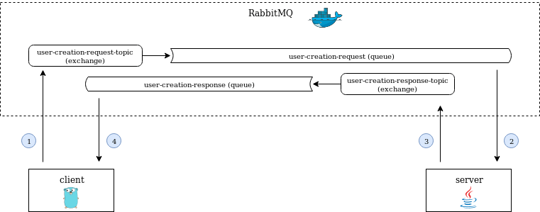

# RabbitMQ

This project is an example of two programs communicating asynchronously using [RabbitMQ](https://www.rabbitmq.com/) - an [AMPQ](https://en.wikipedia.org/wiki/Advanced_Message_Queuing_Protocol) message broker.

## Project Contents
1. A [docker-composer yaml file](docker/docker-compose.yml);
2. A [client program](rabbitmq-client/) written in Go;
3. A [server program](rabbitmq-server/) written in Java.

## Structure and flow

1. When client program is executed, it creates a "create user" message and send it through "user-creation-request-topic" which dispatches it to "user-creation-request" queue.
2. Server program is monitoring "user-creation-request" queue, so it receives a copy of "create user" message.
3. Server program processes user creation request and sends a "create user response" message though "user-creation-response-topic" exchange which dispatches it to "user-creation-response" queue.
4. Client program is monitoring "user-creation-response" queue, so it receives the response message sent by server and process it.

## Requirements
The following versions were the ones used to create it on my environment. Higher versions might work as well, but who knows? :)
- Docker 19.03.2
- Docker compose 1.21.0
- Java 1.8
- Maven 3.6.2
- Go 1.13.4

## Execution
1. On [docker](docker/) directory, start the RabbitMQ container using `docker-compose up` command. It will build a new Docker image based on original RabbitMQ's. This new image adds some configuration files to automatically create users, queues, exchanges and bindings.
2. On [rabbitmq-server](rabbitmq-server/) directory, execute `mvn package` to generate the executable jar file.
3. Start the server program by executing `java -jar target/rabbitmq-server-1.0-executable.jar`.
4. On [rabbitmq-client](rabbitmq-client/) directory, execute `go build` to generate the client executable.
5. To run the client, execute `rabbitmq-client -name="Marcelo Leite"`. It accepts a parameter `name` wich informs the user name for its creation. If no argument if informed, the client will send "John Doe" as the user name.
